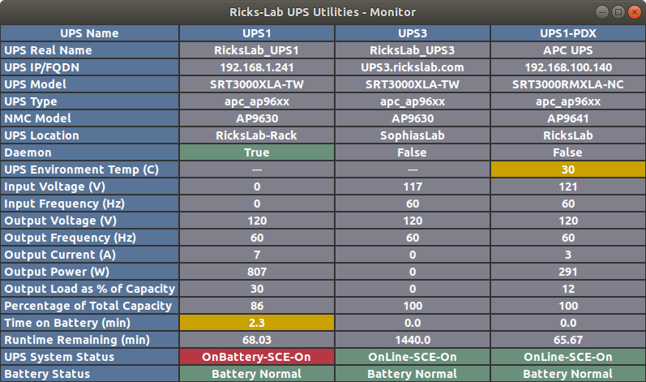

# Ricks-Lab UPS Utilities - User Guide

A set of utilities to monitor and react to the status of a set of supported UPSs.

## Current rickslab-ups-utils Version: 1.x.x

 - [Installation](#installation)
 - [Getting Started](#getting-started)
 - [Using ups-ls](#using-ups-ls)
 - [Using ups-mon](#using-ups-mon)
 - [Using ups-daemon](#using-ups-daemon)


## Installation

There are 4 methods of installation available and summarized here:
* [Repository](#repository-installation) - This approach is recommended for those interested
in contributing to the project or helping to troubleshoot an issue in realtime with the
developer. This type of installation can exist along with any of the other installation type.
* [PyPI](#pypi-installation) - Meant for users wanting to run the very latest version.  All
**PATCH** level versions are released here first.  This install method is also meant for
users not on a Debian distribution.
* [Rickslab.com Debian](#rickslabcom-debian-installation) - Lags the PyPI release in order
to assure robustness. May not include every **PATCH** version.

### Repository Installation

For a developer/contributor to the project, it is expected that you duplicate the development environment
using a virtual environment. So far, my development activities for this project have used python3.6. 
The following are details on setting up a virtual environment with python3.6:

```shell
sudo apt install -y python3.6-venv
sudo apt install -y python3.6-dev
```

Clone the repository from GitHub with the following command:

```shell
git clone https://github.com/Ricks-Lab/ups-utils.git
cd ups-utils
```

Initialize your *rickslab-ups-utils-env* if it is your first time to use it. From the project root directory, execute:

```shell
python3.6 -m venv rickslab-ups-utils-env
source rickslab-ups-utils-env/bin/activate
pip install --no-cache-dir -r requirements-venv.txt
```

On newer systems, I have found that I get a `ModuleNotFoundError: No module named 'numpy'`, even though `numpy` was
successfully installed in the newly created virtual environment.  To resolve this, I deactivated the venv and installed
it for the system instance of python.  When back in the venv, the issue is resolved.  There seems to be a bigger 
issue in using some packages, including Gtk and numpy, from within a virtual environment.

You then run the desired commands by specifying the full path: `./ups-ls`

### PyPI Installation

Install the latest package from [PyPI](https://pypi.org/project/rickslab-ups-utils/) with the following
commands:

```shell
pip3 install rickslab-ups-utils
```

Or, use the pip upgrade option if you have already installed a previous version:

```shell
pip3 install rickslab-ups-utils -U
```

You may need to open a new terminal window in order for the path to the utilities to be set.

### Rickslab.com Debian Installation

First, remove any previous PyPI installation and exit that terminal.  If you
also have a Debian installed version, the pip uninstall will likely fail,
unless you remove the Debian package first.  You can skip this step if you
are certain no other install types are still installed:

```shell
sudo apt purge rickslab-ups-utils
sudo apt autoremove
pip uninstall rickslab-ups-utils
exit
```

If you had previously (before 1.2.0) installed from rickslab.com, you should
delete the key from the apt keyring:

```shell
sudo apt-key del C98B8839
```

Next, add the *rickslab-ups-utils* repository:

```shell
wget -q -O - https://debian.rickslab.com/PUBLIC.KEY | sudo gpg --dearmour -o /usr/share/keyrings/rickslab-agent.gpg

echo 'deb [arch=amd64 signed-by=/usr/share/keyrings/rickslab-agent.gpg] https://debian.rickslab.com/ups-utils/ stable main' | sudo tee /etc/apt/sources.list.d/rickslab-ups-utils.list

sudo apt update
```

Then install the package with apt:

```shell
sudo apt install rickslab-ups-utils
```

If you decide to no longer use this type of install, you can remove
rickslab-ups-utils from the system repository list by executing the following:

```shell
echo '' | sudo tee /etc/apt/sources.list.d/rickslab-ups-utils.list
```

## Getting Started

# Configuration

Application configuration parameters must be specified in the `ups-utils.ini` file.  A
set of template files are provided: `ups-utils.ini.template` and `ups-config.ini.template`.
You can determine the location of the template files to modify by executing the following command:

```shell
ups-ls --about
```

Once you have created the .json and .ini files from the template files, you can verify
the values of the configuration settings by executing:

```shell
ups-ls --list_params
```

Also, a UPS list must be specified in the `ups-config.json` file using `ups-config.json.template`
as a template.  This file contains details about each UPS that make snmp communication possible.
The utility requires snmp v2c in order to communicate with the network accessible UPSs.  As a
result, you must configure your target Network attached UPS devices to use SNMPv2 with a known
Private Community String.

If you installed from debian package, the template configuration files will be owned by root.  When
you create your configuration files from the templates, you MUST change group ownership to
*upsutils* and change permissions to 660:

```shell
cd /usr/share/rickslab-ups-utils/config/
sudo chgrp upsutils ups-utils.ini ups-config.json
sudo chmod 660 ups-utils.ini ups-config.json
```

If you installed from PyPI, you will be the owner of the file, so there is no need to change
group ownership, but the configuration files must be readable by only you:

```shell
cd ~/.local/share/rickslab-ups-utils/config
chmod 600 ups-utils.ini ups-config.json
```

To assure the use of the utilities only with secure configuration files, all utilities should
exit with an error if not properly secured.

The ups-utils rely on the command *snmpget* which is part of the snmp package that must
be installed:

```shell
sudo apt install snmp
```

## Using ups-ls

After getting your system setup to support **rickslab-ups-utils**, it is best to verify functionality by
listing your UPS details with the *ups-ls* command.  The utility will read the `ups-config.json` to get
a list of configured UPSs. The utility will also verify accessibility of the listed UPSs. 

## Using ups-mon



## Using ups-daemon


